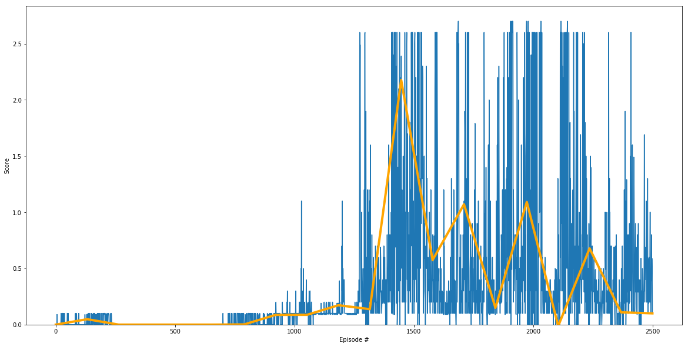

[//]: # (Image References)
[image1]: images/tennis.png "Tennis"

# Project 2: Collabotation and Competition
## Udacity Deep Reinforcement Learning
The purpose of this document is to describe the details of the project; including the algorithm, network architecture, training hyperparameters and results.

Most of the code for this project is based on the course work and repository for [DDPG Bipedal](https://github.com/udacity/deep-reinforcement-learning/tree/master/ddpg-bipedal).

--- 
## Project overview 
The goal of this project is to have 2 agents play tennis and the two agents control rackets to bounce a ball over a net.

![image1]

As described in the project: *A reward of +0.1 is provided to each agent for putting the ball over the net. If an agent lets a ball hit the ground or hits the ball out of bounds it received an award of -0.01. Thus, the goal of each agent is to keep ball in play.*

*The observation space consists of 8 variables corresponding to position and velocity of the ball and racket. Two continuous actions are available, corresponding to movement toward (or away from) the net, and jumping.*
*The task is episodic, and in order to solve the environment, your agents must get an average score of +0.5 (over 100 consecutive episodes, after taking the maximum over both agents).*

## Algorithm 

The algorithm used and the code is exactly the same as was used for the Continuous control project i.e.:
**Deep Deterministic Policy Gradient (DDPG)** The algorithm adapts the ideas underlying the success of Deep Q-Learning to the continuous
  action domain. It is classified an actor-critic, model-free algorithm based on the deterministic policy gradient that can operate over continuous action spaces.

An **actor** is used to tune the parameters 𝜽 for the policy function i.e. decide the best action for a specific state while a **critic** is used to evaluate the policy function estimated by the actor according to the temporal difference (TD) error (*TD learning is a way to learn how to predict a value depending on future values for a given state, similar to Q-Learning*). 

To improve stability, DDPG borrows the ideas of **experience replay** and **fixed Q-targets** from DQN.

One side-effect using a policy-based approach is the tendency to converge at local minima; to mitigate this a noise is added to the action during training to encourage exploration. 

The network architecture for the

Actor:
* State input BatchNorm layer
* 2 Fully connected layers followed by Relu activation and BatchNorm
* Output Layer has action 4 outputs followed by Tanh activation to constrain outputs to -1 to +1

Critic:
* 1st Layer is State input to a Fully connected layer (128) followed by Relu activation and BatchNorm
* 2nd Layer additionally takes the action from to a Fully connected layer (128) followed bu a Relu activation
* Output layer with a single output.

The link to the paper [Continous Control with Deep Reinforcement Learning](https://arxiv.org/pdf/1509.02971.pdf). 

## Training  
In this section we present the results from training; including the hyper parameters and average score achieved after training. 

Training (after much experimentation) used the following hyperparameters:
- Replay buffer size - **100000** 
- Minibatch size - **64**
- Discount factor (gamma) - **0.99**
- Soft update interpoloation (TAU) - **1e-3**
- Learning rate of the actor - **1e-4**
- Learning rate of the critic - **1e-3**
- Number of episodes played - **2500**
- Max time (number of steps) per episode - **Until done** 

The following plot shows the score achieved during training; demonstrating the agents were able to meet the 0.5 average score goal after roughly 1300 episodes.

## Ideas for Future Work 
The amount of experimentation that could be performed was somewhat limited because of availability GPU compute time to perform training. Some ideas include: 
- Try solving using a single policy for both agents.
- Train the agent using pixel inputs as demonstrated by the authors of rhe paper which would be quite cool and can be of great significance.